<div align="center">


# Kairn

**A calm, local-first day planner for Windows, made for minds that wander.**

Your day hour by hour, a work rhythm that suits you, a gentle guard against distractions,
and an assistant that turns “I want to learn this” into real sessions in your calendar.
No account. No cloud. Nothing leaves your PC unless you decide so.

[**Download for Windows**](https://github.com/zakenoo/Kairn/releases/latest) · [Features](#features) · [Privacy](#privacy) · [FAQ](#faq) · [Support on Ko-fi](https://ko-fi.com/zakenoo)


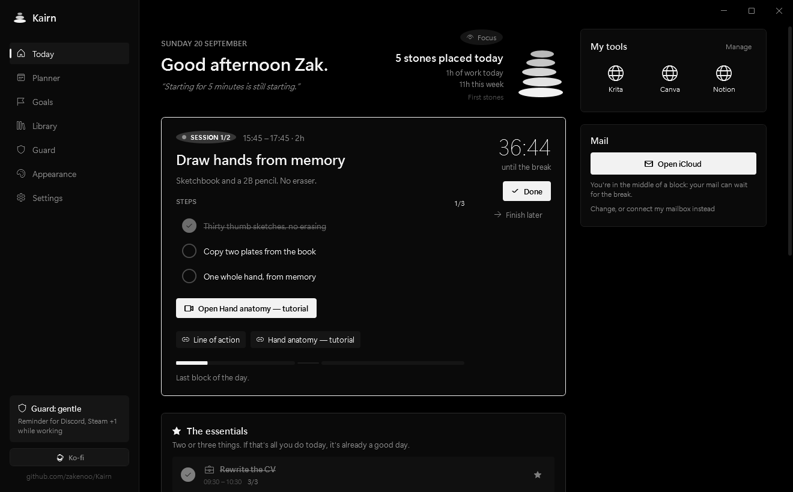

</div>

## Why Kairn

Kairos was the Greek god of the right moment; a cairn is the small pile of stones that marks a trail. Kairn is both: landmarks for your day, placed at the right time.

It was built for people who find it hard to start, to stay on track, or to forgive themselves when a day doesn't go to plan, including people with ADHD. Four principles shape everything:

- **No guilt.** There's no percentage of what you *didn't* do, and no streak to keep alive. Progress is a cairn that gains a stone for every finished task and every finished step, plus the time you actually worked. A day you skip never takes a stone away.
- **Nothing is lost.** An unfinished task isn't a failure: it moves to your next work session, in “To pick up”.
- **Starting is the hard part.** Every plan begins with an easy first step, long tasks are cut into short sessions, and the next action is always in plain sight.
- **Your data is yours.** Everything is stored as plain files on your PC. No account, no telemetry, no ads.

There is also one thing Kairn deliberately does *not* do: it never asks you to sort, rate or prioritise. There's a single way to say “this one counts” — a star, one click, capped at three.

## Features

### Today
The task in progress with a live countdown, what comes next, and your whole day at a glance. Links attached to a task (a Figma file, a YouTube tutorial, a document) get a one-click button when it's time, and can even open by themselves. Your work tools sit on the side, and your mail can stay out of sight during work blocks.

**The essentials** holds the two or three things that really matter today, and nothing more. **Focus** hides everything else in one click: only the task you're on stays, and one click brings the rest back.

### Steps
A task can be cut into steps you tick off one by one, until the first one is small enough to be impossible to put off. The task in progress shows them as a checklist, the assistant turns its instructions into steps by itself, and one button turns your notes into steps, one line each.

Every step you finish adds a stone to the cairn, exactly like a finished task: starting counts as much as finishing.

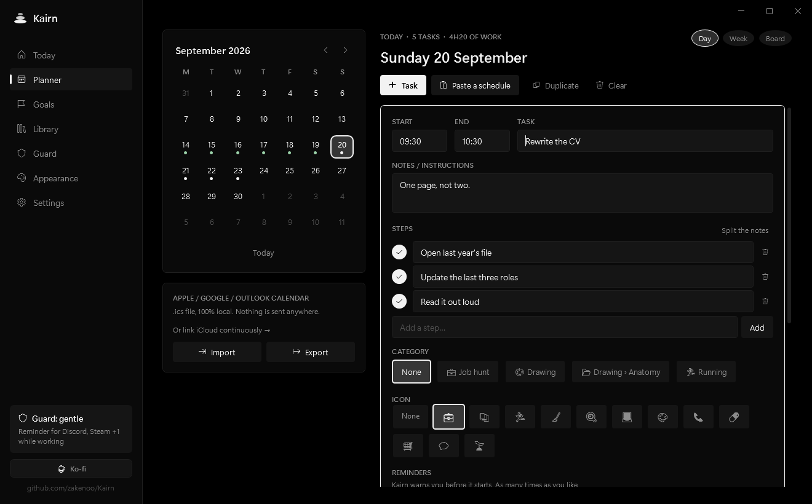

### Planner
A monthly calendar where you add tasks on time slots, or **paste a whole schedule as plain text**: `9:30 Study`, `12:00 - 13:00 Lunch`, `2pm 📝 Write CV #pomodoro`. Indented lines become notes, lines without a time become section titles, an icon at the start of a line becomes the task's icon, and you get a live preview before anything is added. Import and export `.ics` files for Apple, Google or Outlook calendars.

Three ways to look at the same days, one click apart:

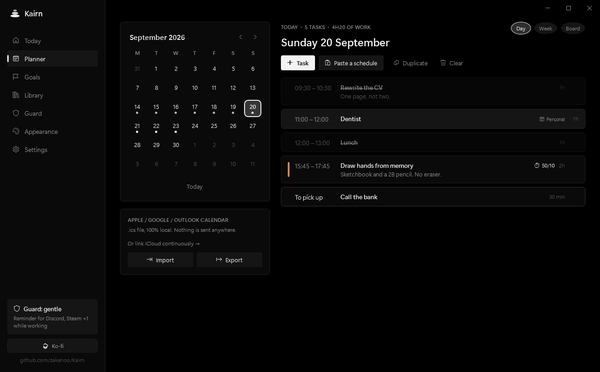

**Week** puts the seven days side by side with the blocks at their hour, and **Board** sorts the day into *To pick up* / *Planned* / *Done*.

<p align="center">
  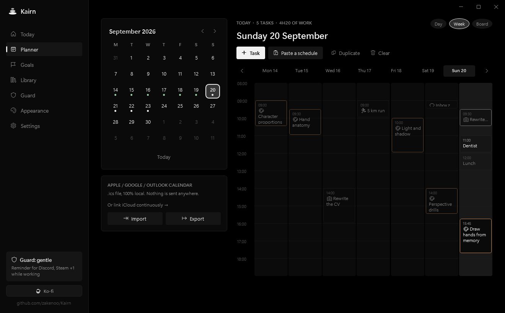
  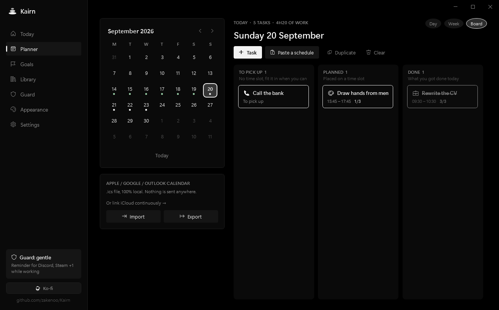
</p>

**Drag a task** wherever it should go: onto another day in the calendar, onto another hour in the week, into another column on the board, or above or below another task to reorder the day. Reordering keeps the day's time slots exactly as you shaped them and just changes what happens when. No dialog, no error message, no guilt.

### Reminders
For a task, pick as many reminders as you need: an hour before, fifteen minutes before, on the hour. A quiet banner says what's coming, how long you have, and the first step to get going, with *On my way* and *In 10 min*. You can set the ones every new task gets in the settings.

### Jotting something down in two seconds
**Ctrl + Alt + K**, anywhere in Windows: a single field appears, you type, you press Enter, it's gone. Without a time the task waits in “To pick up”; start with one (`2pm Study`) and it lands straight in your day. It's also in the notification-area menu. An idea that needs you to find a window, pick a day and type two times is an idea you've already lost.

### Work rhythm (Pomodoro & co)
Long tasks split themselves into sessions and breaks, with no manual planning: Pomodoro 25/5 (with a long break every four sessions), Small steps 15/5, Focused 50/10, Deep work 90/20, or your own. Pick it per task, add `#pomodoro` or `#50/10` to a pasted line, or apply it automatically to every long task. A discreet banner (with an optional soft sound) announces each break and each restart, and the guard rests during breaks.

### Your iCloud calendar, both ways
Link your iCloud account and **your real appointments appear in your day** — they hold their slot, so the assistant stops planning a drawing session in the middle of your dentist appointment. They're read-only in Kairn: a meeting isn't a task you tick off, and the place to change it is Apple's Calendar app.

Turn on sending and **your Kairn sessions go up to iCloud**, so they're on your iPhone and your Mac. Kairn creates its own “Kairn” calendar for that and **only ever writes there** — it never touches an event it didn't create.

Nothing happens until you link an account yourself, nothing is shown until you tick which calendars to share, and sending is a separate switch that starts off. “Unlink” removes the imported appointments from Kairn and leaves your Apple side untouched. It needs an [app-specific password](https://account.apple.com), not your Apple password, and it's revocable from Apple at any time. Recurring events are expanded by Apple's own server, so “every Tuesday” really comes back as every Tuesday, with its exceptions.

The same protocol (CalDAV) works for Fastmail, Nextcloud and Synology. Google removed simple-password CalDAV, so for Google Calendar the `.ics` import is still the way.

### Goals, with an assistant
Write what you want to achieve and how long you have, for example “run 5 km without stopping, 8 weeks, mornings”. The assistant asks two or three questions if needed, writes a roadmap in phases, and details the next two weeks as concrete sessions with tutorial links. Each session arrives with its instructions already cut into steps you can tick off.

**Kairn then places those sessions itself, without AI, in the slots that are actually free in your calendar** — including around the appointments it read from iCloud, if you linked it — so dates are always right and nothing overlaps. You review everything, untick what you don't want, and only then add it. When the two weeks are almost over, “Prepare what's next” builds the following ones from what you did and how it felt (too easy, just right, too hard).

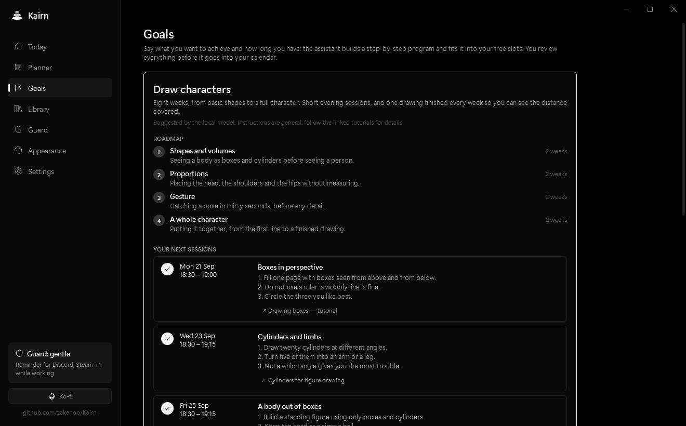

The assistant runs **on your PC** by default (see [the local model](#the-local-ai-model)). You can also connect your own API key for Claude or an OpenAI-compatible service, for more precise plans and real resources found on the web.

### Library
Categories and subcategories (Drawing › Anatomy…) to keep links, notes, images and files together. Files are copied locally and stored in folders named after your categories. A task linked to a category shows its resources while you work on it. Paste a screenshot with Ctrl+V, drag and drop files, delete with one click and undo if you change your mind.

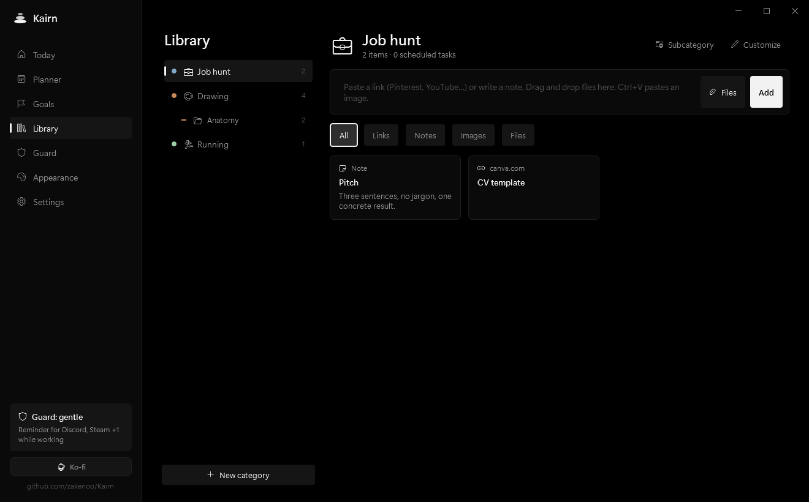

### Guard
Pick what distracts you (Discord, Steam, games in fullscreen, a browser…) from a catalog of about thirty common apps, detected automatically on your PC, or add any program. Then choose how Kairn reacts during work blocks:

| Mode | What happens |
|---|---|
| **Gentle** | A small banner reminds you of the task in progress. Nothing is closed. |
| **Close** | Distracting apps are closed at the start of each work block. You can reopen them. |
| **Strict** | They are closed again as soon as they reopen during a block. |

The guard never acts during breaks or outside your schedule, and “Pause 15 min” is always one click away.

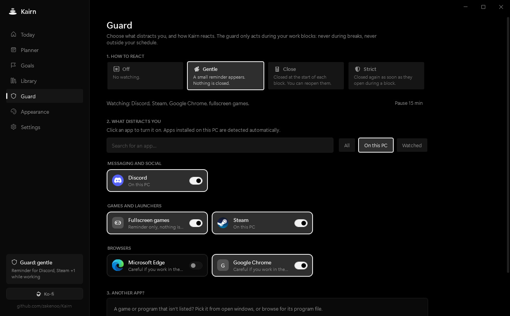

### Appearance
Twelve ready-made themes, and everything is editable: all twelve interface colors, a background image for any block (with an adjustable veil to keep text readable), fonts, size, corners and borders. Even the taskbar icon follows your colors. Save your themes and share them as `.kairntheme` files.

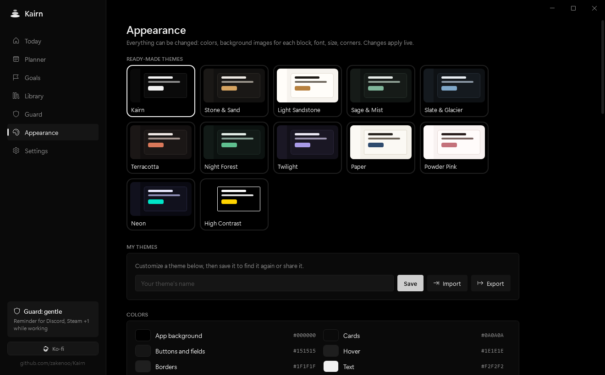

### Everything else
- **12 languages**: English, 中文, हिन्दी, Español, Français, العربية (mirrored right-to-left interface), বাংলা, Português, Русский, 日本語, Deutsch, Bahasa Indonesia. Dates, days and durations follow your language.
- **Mail**: read your inbox (IMAP) inside Kairn, or simply get a button that opens your webmail in the browser. During work blocks, only the unread count is shown.
- **A small reward**: a short, discreet sound when you tick something off, the line lights up, and confetti for the last task of the day. Both can be turned off.
- **Starts with Windows** (optional), lives quietly in the notification area.

## Install

1. Download **`Kairn-Setup-x.y.z.exe`** from the [latest release](https://github.com/zakenoo/Kairn/releases/latest).
2. Run it: pick your language, your look (the setup takes on its colors live), your first name and a few options.
3. That's it: Kairn opens ready to use.

<p align="center">
  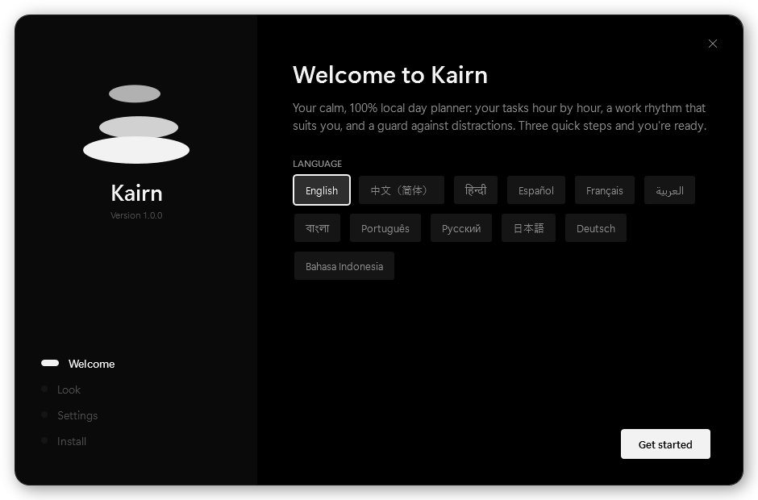
  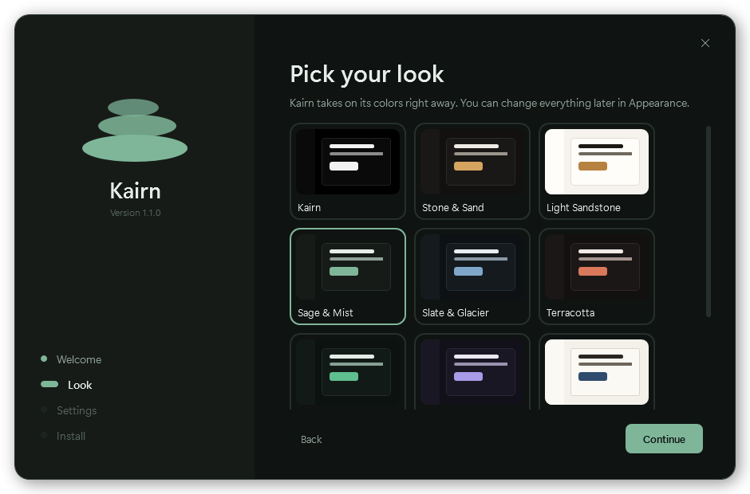
</p>

**Requirements:** Windows 10 or 11, 64-bit. About 100 MB of disk space. Nothing else to install: the setup contains everything Kairn needs.

**No administrator rights needed.** Kairn installs in `%LocalAppData%\Programs\Kairn`, adds a Start menu shortcut, and, only if you ask for it, a desktop shortcut and a launch at Windows startup.

> **“Windows protected your PC”?** Kairn isn't signed with a paid code-signing certificate yet, so Windows SmartScreen warns about it the first time. Click **More info → Run anyway**. If you'd rather not trust a binary, you can [build Kairn from source](#build-from-source) in two commands.

**Uninstall** from *Settings → Apps → Kairn*, like any app. It removes the program, its shortcuts and its startup entry. Your data is kept unless you tick “Also delete my data”, so a reinstall picks up exactly where you left off.

**Portable mode:** create a folder named `data` next to `Kairn.exe`, and Kairn keeps everything in it instead of your user profile, handy for a USB stick.

## Updates

If you allow it (it's an option in the setup and in Settings), Kairn asks GitHub once a day whether a newer version exists. When one does, a card appears in the sidebar: one click downloads the new setup, **checks its SHA-256 fingerprint against the one published by GitHub**, replaces Kairn and restarts it. Your tasks and settings are untouched, and new settings simply start at their defaults.

If you'd rather not, leave the option off and use **Settings → Updates → Check now** whenever you like.

## Privacy

Kairn has **no account, no telemetry, no analytics, no crash reporting and no ads.** It works fully offline. Here is every single way it can talk to the internet. Each one is optional and triggered by you:

| Connection | When | What is sent | To whom |
|---|---|---|---|
| **Your mailbox** | Only if you connect one | Your login, over an encrypted connection, to read your mail | Your mail provider (Gmail, iCloud…) |
| **Your iCloud calendar** | Only if you link one | Your Apple ID and an app-specific password, to read the calendars **you ticked**. If you also turn on sending, the tasks you planned in Kairn go up into a separate “Kairn” calendar. | Apple |
| **Local AI model download** | Once, when you click *Install* in Settings | Nothing about you: a plain file download | GitHub (llama.cpp engine) and Hugging Face (model) |
| **Online AI mode** | Only if you add an API key *and* choose “Online” for a goal | Your goal and your answers to the assistant's questions. **Never your calendar, notes, library or mail.** | The provider you configured (Anthropic, OpenAI…) |
| **Update check** | Only if enabled, once a day, or when you click *Check now* | A standard request asking for the latest version number | GitHub |
| **Links you open** | When you click one | A normal visit in your browser | That website |

**Where your data lives:** `%AppData%\Kairn`, as readable JSON files (`data.json`, `settings.json`) plus a `library` folder for your files. Back it up or move it to another PC by copying that folder.

**Secrets are encrypted.** Your mail password, your calendar password and your API key are encrypted with Windows DPAPI: only your Windows account, on this PC, can decrypt them. (It also means you'll re-enter them after moving to a new PC.)

**What the guard can see:** during work blocks only, it reads the name of the app in the foreground every two seconds (for example `Discord`), compares it with your list, and that's it. Nothing is logged, stored or sent. It only closes apps in the Close and Strict modes that you choose, and never touches fullscreen apps other than showing a reminder.

**What goes into Windows:** a Start menu shortcut, an entry in *Apps* for uninstalling, and, if you enabled it, a startup entry in your user's `Run` registry key. The quick-capture shortcut (Ctrl + Alt + K) is registered only while Kairn is running, and released when it quits. Nothing system-wide, nothing that needs admin rights.

## The local AI model

The assistant works fully offline with a small open model, installed on demand from *Settings → Goal assistant → Install*:

- **Model:** [Qwen3 4B Instruct](https://huggingface.co/unsloth/Qwen3-4B-Instruct-2507-GGUF) (Apache 2.0 license), about 2.5 GB, run by [llama.cpp](https://github.com/ggml-org/llama.cpp). Both files are verified by SHA-256 after download, and an interrupted download resumes where it stopped.
- **Only while it works:** the engine starts when you ask for a plan, listens on `127.0.0.1` only (unreachable from your network), and shuts down three minutes after your last request. It never runs in the background, and it's stopped automatically if Kairn closes or crashes.
- **Graphics card if possible:** on a recent GPU, a full program takes about 15–30 seconds; on the processor alone, count one or two minutes. You can turn the GPU off in Settings.
- **Honest expectations:** a 4-billion-parameter model is great at breaking a goal into a sensible progression, but it can be generic, and may get details wrong for specific software. That's why every session links to a tutorial, and why the online mode exists for more precise plans.
- **Already use Ollama or LM Studio?** Pick it in Settings and Kairn uses the models you already have, with nothing to download.

## FAQ

<details>
<summary><b>Is Kairn free?</b></summary>

Yes. No trial, no premium tier, no ads. If it helps you, you can [buy me a coffee on Ko-fi](https://ko-fi.com/zakenoo). That's entirely optional.
</details>

<details>
<summary><b>Does it need an internet connection?</b></summary>

No. Everything works offline. Only the optional features listed in [Privacy](#privacy) use the network, and only when you use them.
</details>

<details>
<summary><b>Will it slow down my PC or my games?</b></summary>

Kairn uses around 100–170 MB of RAM and well under 1% of the processor while it sits in the background. The guard only reads one process name every two seconds, during work blocks. The local AI model never runs in the background: it only starts while it's generating a plan, then frees its memory.
</details>

<details>
<summary><b>Does the AI see my calendar or my notes?</b></summary>

No. In local mode nothing leaves your PC anyway. In online mode, only your goal and your answers to the assistant's questions are sent. Placing the sessions in your calendar is done by Kairn itself, locally, without AI.
</details>

<details>
<summary><b>Can I use my ChatGPT Plus or Claude Pro subscription instead of an API key?</b></summary>

No. Those subscriptions only work in the official apps, and connecting them to third-party apps isn't allowed by their providers. The online mode needs an API key (billed separately, per use). The local mode is free and needs neither.
</details>

<details>
<summary><b>Why is the download around 100 MB?</b></summary>

The setup includes the .NET runtime, so you don't have to install anything else. Kairn itself is small.
</details>

<details>
<summary><b>Why does Windows or my antivirus warn me?</b></summary>

Because the executable isn't signed with a paid code-signing certificate. The code is public: you can read it, and [build it yourself](#build-from-source) if you prefer.
</details>

<details>
<summary><b>Can I connect my Google, Apple or Outlook calendar?</b></summary>

**iCloud** can be linked properly, both ways, if you want it to: see [Your iCloud calendar](#your-icloud-calendar-both-ways). It's off until you link it yourself.

For **Google and Outlook**, it's `.ics` files (Planner → Import / Export): a one-time import, not a live link. Google no longer allows a simple password for calendar access, and Kairn won't ship a hidden client secret to work around it.
</details>

<details>
<summary><b>Do my reminders work when Kairn is closed?</b></summary>

No. Reminders are fired by Kairn itself, so it has to be running — which is what “start with Windows” and the notification area are for. Nothing is scheduled in Windows behind your back.
</details>

<details>
<summary><b>What happens to a task I didn't finish?</b></summary>

It moves to your next work session, in “To pick up”, without an hour. Give it a time slot when you're ready, or tick it off when it's done. Nothing piles up as red marks.
</details>

<details>
<summary><b>How do I back up my data or move to another PC?</b></summary>

Copy the `%AppData%\Kairn` folder (or your `data` folder in portable mode). On the new PC, install Kairn and put the folder back. You'll need to re-enter your mail password, calendar password and API key, which are encrypted for your Windows account only.
</details>

<details>
<summary><b>Is there a Mac or Linux version?</b></summary>

Not at the moment: Kairn is a native Windows app (WPF). It keeps it light and well integrated with Windows.
</details>

<details>
<summary><b>I found a bug or a translation mistake.</b></summary>

Please [open an issue](https://github.com/zakenoo/Kairn/issues). For translations, you can also fix them yourself without recompiling (see [Translations](#translations)).
</details>

## Build from source

You need the [.NET 10 SDK](https://dotnet.microsoft.com/download) on Windows.

```powershell
git clone https://github.com/zakenoo/Kairn.git
cd Kairn
dotnet run --project Kairn -c Release
```

To produce the setup (a single self-contained file in `release\`):

```powershell
.\publish.ps1            # current version
.\publish.ps1 1.2.0      # bump the version, then build
```

The setup is Kairn itself: the same executable opens in install mode when its name starts with `Kairn-Setup`. Publishing an update means creating a GitHub release tagged `v1.2.0` with that file attached. Installed copies that allow update checks will offer it on their own.

## Translations

All interface texts live in [`Kairn/i18n`](Kairn/i18n), one JSON file per language. English is the reference: a missing key falls back to English, then to French, then to the key itself.

To fix a translation or add a language **without recompiling**, open *Settings → Open the language folder*: it contains a short guide and a complete English template. Drop an `xx.json` file there and restart Kairn.

Pull requests with translation fixes from native speakers are very welcome.

## Support

Kairn is free and made on my own time. If it makes your days a bit calmer, you can support it on **[Ko-fi](https://ko-fi.com/zakenoo)** ☕, star the repository, or simply tell someone who might need it.
